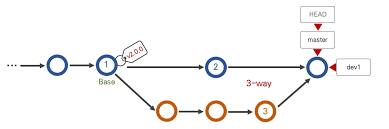

# 3 WAY MERGING IT'S A METHOD THAT THE GIT DO, WHEN YOU MERGE A FEATURE/BRANCH AND THE MAIN REMOTE WAS AHEAD THEN YOUR MAIN LOCAL, AND ADD A COMMENT WHEN MERGING

**GIT MERGE --NO-FF:** Forces the git t do a 3way merge and add a comment

